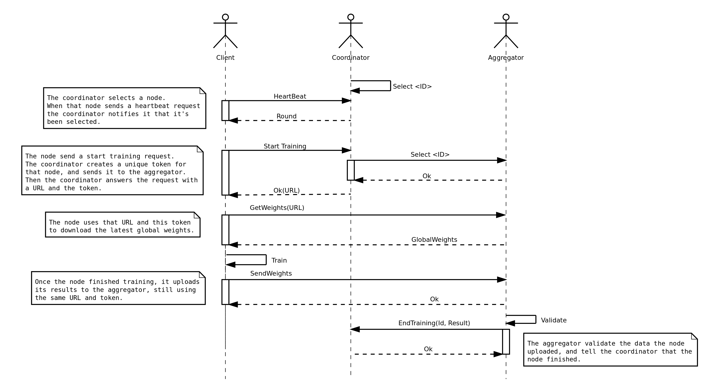
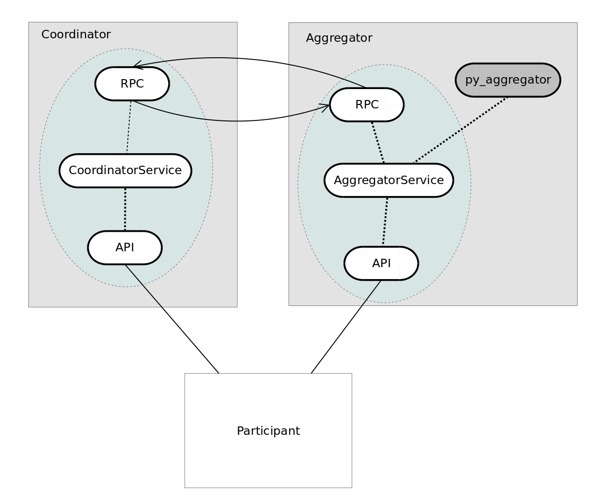

# XAIN FL - POC Branch

- [XAINet Documentation](https://xain-fl.readthedocs.io/en/latest/): Papers and API references.
- [XAINet SDK Documentation](https://xain-fl.readthedocs.io/projects/xain-sdk/en/latest/): Tutorial and API references.
- [XAINet Repository](https://github.com/xainag/xain-fl/blob/poc/CONTRIBUTING.md): Source code and developer information.






## Quick Setup Guide

Clone the POC branch of the git repository:

```
git clone --single-branch --branch poc https://github.com/xainag/xain-fl.git
```

Start the platform (coordinator and aggregator) with docker-compose in development mode:

```
docker-compose -f docker/docker-compose.yml up --build
```

Configuration of settings is available via the `toml` files in the `configs/` directory. In this case it is `configs/docker-dev-coordinator.toml` for the coordinator and `configs/docker-dev-aggregator.toml` for the aggregator configurations.

More options and detailed information can be found in the [repository readme](https://github.com/xainag/xain-fl/blob/poc/CONTRIBUTING.md).


## Participant Implementation

Two participant examples written in Python are provided in [`xain-fl/python/client_examples`](https://github.com/xainag/xain-fl/tree/poc/python/client_examples) and instructions how to run them in the [examples readme](https://github.com/xainag/xain-fl/blob/poc/CONTRIBUTING.md#running-the-python-examples).

To write a Python implementation of your own participant, install the SDK:

```
pip install python/sdk/ -e .
```

Then provide an implementation for the three methods of the abstract `ParticipantABC` class defined in `xain-fl/python/sdk/xain_sdk/participant.py`. The most important one is

```python
train_round(self, training_input: TrainingInput) -> TrainingResult
```

which takes any type of object, and returns a result, which can also be any type of object. This is the method that the SDK will call to perform the training. The `training_input` argument will be the global model retrieved from the coordinator. The training result returned by `train_round` will be sent to the coordinator. During the first round, the coordinator will send an empty message, which causes the `training_input` to be `None`. In that case, a fresh model must be initialized to perform the training. Then come the methods used for data (de-)serialization. The method

```python
deserialize_training_input(self, data: bytes) -> TrainingInput
```

is called right after the SDK has downloaded the latest global model from the coordinator. It is used to deserialize the data that will be passed to `train_round`. The method

```python
serialize_training_result(self, training_result: TrainingResult) -> bytes
```

is its counterpart and is called by the SDK to serialize the value returned by `train_round`, such that it can be sent to the coordinator. A detailed tutorial on the SDK and participant implementation can be found [here](https://xain-fl.readthedocs.io/projects/xain-sdk/en/latest/tutorial.html).


## Preprocessed Data

The [CIFAR-10](https://www.cs.toronto.edu/~kriz/cifar.html) dataset has been preprocessed to provide a suitable dataset for an example case. It can be found in `xain-fl/poc/data/cifar10` and has a similar dataset layout like the original dataset, except that every data batch contains data from exactly one category (the test batch remains the original one). Hence, any partition of categories for a federated learning setting can easily be created.

The data and test batches can be loaded into a python dictionary:

```python
import pickle

with open("xain-fl/poc/data/cifar10/data_batch_0", "rb") as batch:
    dataset = pickle.load(batch, encoding="bytes")
```

The image data can be accessed as `numpy.uint8` arrays of shape `(5000, 3072)` and the labels as lists of integers of length `5000`:

```python
data = dataset["data"]
labels = dataset["labels"]
```
